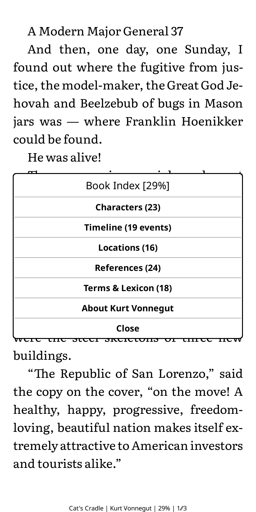
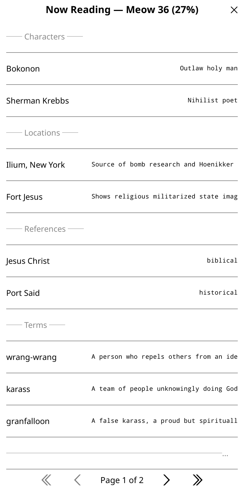

# marginalia

AI reading companion for KOReader — Book Index, position-bounded RAG, highlights, and Obsidian notes.

> Like Kindle X-Ray, but for any book, any e-reader, any LLM, with your own Obsidian vault as the note backend.

**[→ First-time setup guide](docs/setup.md)** · [AI providers](docs/providers.md) · [Calibre](docs/calibre.md) · [Obsidian](docs/obsidian.md)

<p align="center">
  
  
  
  
</p>

---

## What it does

marginalia runs a small bridge server on your computer that your KOReader device talks to over your local network (or Tailscale). When you open a book, it:

1. **Generates a Book Index** — characters, locations, terms, literary/mythological references, and a chapter-positioned timeline, extracted from the full EPUB text via your LLM of choice. Cached locally. Falls back to model knowledge if the EPUB isn't in Calibre.
2. **Builds a RAG index** — chunks the book text, embeds it, and stores a position-aware retrieval index so every AI answer is grounded in passages *you've already read*. No spoilers by construction.
3. **Syncs with your Obsidian vault** — Ask AI lookups and manual saves create highlights in the book and append formatted entries to the book's vault note.

**Companion features (all spoiler-safe):**
- **Ask AI** — select text → get an explanation, translation, or context from the bridge
- **AI Wiki** — deep-dive on any character, place, or term from the Book Index
- **Recap** — "where you left off" summary when returning after a break
- **Section** — chapter-by-chapter analysis
- **Chat** — free Q&A grounded in your reading position
- **Series intelligence** — cross-book context includes prior books you've finished; future books are excluded

**Capture:**
- **Ask AI** lookups and **AI: Save Note** create a saved highlight in KOReader (with the AI answer or your context as the highlight note) and append the passage + answer to the book's Obsidian note (`Notes/Books/<Author> - <Title>.md`)
- **Chat → To Book Note** appends the freeform Q&A (question + AI answer, no highlighted passage) to the book's Obsidian note
- **Chat → Save as Note** creates a standalone note in `Notes/Captures/` with YAML frontmatter and a wikilink back to the book; a title dialog lets you name the note before saving

**Ops:**
- Live request monitor at `http://localhost:7731/monitor`
- Intelligent fallback chain: primary model → cheaper fallback → terminal fallback, with a per-model circuit breaker that skips recently-failed models and re-probes automatically

---

## Requirements

- **macOS, Linux, or Windows** — wherever the bridge runs
- **Python 3.11+**
- **KOReader** on an Android/Boox device, Kindle, or any device that runs it
- **Calibre** (optional but recommended — without it, Book Index uses model knowledge only)
- **One of:** an OpenAI API key, an Anthropic API key, or AWS credentials for Bedrock

---

## Quick start

### Option A — Install script (recommended)

```bash
curl -sSL https://raw.githubusercontent.com/samfoy/marginalia/main/install.sh | bash
```

Installs to `~/.marginalia`, creates a venv, and launches the setup wizard. Provider options:

```bash
curl -sSL https://raw.githubusercontent.com/samfoy/marginalia/main/install.sh | MARGINALIA_PROVIDER=anthropic bash
curl -sSL https://raw.githubusercontent.com/samfoy/marginalia/main/install.sh | MARGINALIA_PROVIDER=bedrock bash
```

### Option B — Docker

```bash
# Copy and edit the env file
cp .env.example .env  # uncomment your provider block
docker compose up -d
```

The bridge listens on port 7731. Point the KOReader plugin at your machine's IP.

### Option C — Manual

```bash
git clone https://github.com/samfoy/marginalia
cd marginalia
python3 -m venv .venv && source .venv/bin/activate
pip install -e ".[openai,embed]"

export MARGINALIA_OPENAI_API_KEY=sk-...
export MARGINALIA_MODEL_ID=openai:gpt-4o
export MARGINALIA_VAULT=~/Documents/YourObsidianVault

marginalia serve   # bridge listens on :7731
```

---

## KOReader plugin

### Install

**Via ADB** (Android/Boox):
```bash
adb push marginalia.koplugin /sdcard/koreader/plugins/marginalia.koplugin
```

**Via file manager / MTP:** copy the `marginalia.koplugin/` folder to `koreader/plugins/` on your device.

Restart KOReader after copying.

### Configure

Top menu → Tools (wrench icon) → **marginalia**

| Setting | Value |
|---|---|
| Host | Your computer's IP or hostname. Same LAN: e.g. `192.168.1.42` or `mycomputer.local`. Tailscale: your Tailscale IP. |
| Port | `7731` |
| Token | Leave empty, or set the same value as `MARGINALIA_TOKEN` |
| Spoiler-free | On (default) — hides entities/events past your reading position |
| Auto-capture lookups | On (default) — highlights looked-up passages with the AI answer |

---

## Running as a background service (macOS)

The setup wizard handles this — it installs and starts the LaunchAgent at the end of Step 4:

```bash
marginalia setup
```

Or install the LaunchAgent directly:

```bash
cd bridge
./install.sh   # detects Python, prompts for vault path, installs and starts the service
```

To manage it afterwards:
```bash
tail -f ~/Library/Logs/marginalia.log
launchctl kill TERM gui/$(id -u)/com.marginalia.bridge   # temporary stop (KeepAlive restarts in ~10s; use bootout to remove permanently)
launchctl bootout gui/$(id -u)/com.marginalia.bridge   # permanent stop/remove
```

For **Linux**, use the included systemd unit — see `bridge/marginalia.service` for installation instructions.

---

## Configuration reference

All settings via environment variables.

### Core

| Variable | Default | Description |
|---|---|---|
| `MARGINALIA_PORT` | `7731` | Bridge HTTP port |
| `MARGINALIA_VAULT` | `~/Documents` | Obsidian vault root |
| `MARGINALIA_BOOKS_DIR` | `<vault>/Notes/Books` | Where per-book note files are saved |
| `MARGINALIA_CAPTURES_DIR` | `<vault>/Notes/Captures` | Where standalone notes (Save as Note) are saved |
| `MARGINALIA_TOKEN` | *(empty)* | Shared secret (set same in plugin settings) |

### LLM providers

| Variable | Default | Description |
|---|---|---|
| `MARGINALIA_OPENAI_API_KEY` | *(empty)* | OpenAI API key (also checks `OPENAI_API_KEY`) |
| `MARGINALIA_ANTHROPIC_API_KEY` | *(empty)* | Anthropic API key (also checks `ANTHROPIC_API_KEY`) |
| `MARGINALIA_MODEL_ID` | `openai:gpt-4o` | Primary model |
| `MARGINALIA_FALLBACK_MODEL_ID` | `us.anthropic.claude-sonnet-4-6` | Terminal fallback (Bedrock/bedrock-mantle primary only; ignored for direct OpenAI/Anthropic) |
| `MARGINALIA_MODEL_CHAIN` | *(auto)* | Explicit comma-separated chain, overrides auto-derivation |
| `MARGINALIA_MODEL_COOLDOWN_S` | `120` | Circuit breaker window (seconds) |
| `MARGINALIA_COMPANION_EFFORT` | `low` | Reasoning effort `none\|low\|medium\|high` (OpenAI/Bedrock; no-op for Anthropic direct) |
| `MARGINALIA_MAX_TOKENS` | `600` | Max tokens for companion responses |

### AWS Bedrock (optional)

| Variable | Default | Description |
|---|---|---|
| `MARGINALIA_AWS_PROFILE` | *(empty)* | AWS credentials profile |
| `MARGINALIA_AWS_REGION` | `us-west-2` | Bedrock region |

### Model ID format

| Prefix | Routes to | Example |
|---|---|---|
| `openai:` | OpenAI API directly | `openai:gpt-4o` |
| `anthropic:` | Anthropic API directly | `anthropic:claude-haiku-3-5` |
| `openai.` | [bedrock-mantle](https://github.com/samfoy/pi-bedrock-mantle) proxy (requires allowlisting) | `openai.gpt-5.5` |
| *(other)* | AWS Bedrock invoke_model | `us.anthropic.claude-sonnet-4-6` |

The fallback chain is derived automatically from the primary model's provider — non-AWS primaries get provider-appropriate cheap fallbacks, not useless AWS fallbacks.

### RAG / embeddings

| Variable | Default | Description |
|---|---|---|
| `MARGINALIA_EMBED_BACKEND` | `auto` | `auto\|local\|openai\|bedrock` |
| `MARGINALIA_LOCAL_EMBED_MODEL` | `all-MiniLM-L6-v2` | sentence-transformers model (~80MB) |
| `MARGINALIA_EMBED_MODEL` | `cohere.embed-english-v3` | Embedding model ID (Bedrock default; for OpenAI use `text-embedding-3-small`) |
| `MARGINALIA_RAG_CHUNK_CHARS` | `1600` | Characters per chunk |
| `MARGINALIA_XRAY_MAX_TOKENS` | `16384` | Max tokens for Book Index generation |
| `MARGINALIA_CHUNK_MODEL_ID` | *(same as MODEL_ID)* | Model for chunked large-book processing |
| `MARGINALIA_MAX_PARALLEL_CHUNKS` | `4` | Concurrent chunks for large books |

Auto-detection order: OpenAI key present → `openai`; sentence-transformers installed → `local`; else → `bedrock`.

---

## How it works

### Book Index generation

When you open a book, the plugin calls `/book-index/init`. The bridge looks up the EPUB in Calibre's `metadata.db`, extracts the full text, and sends it to the configured LLM with a structured schema prompt. The result (characters, locations, terms, references, timeline) is cached at `~/.marginalia/cache/<md5>.json`. Generation is automatic and non-blocking — the plugin polls `/book-index/status/<job_id>` until complete.

### RAG index

After Book Index generation, the bridge chunks the EPUB text, embeds all chunks with the configured embedding backend, and stores the result alongside the Book Index. At query time, chunks are filtered to `position_pct ≤ reading_pct` (the spoiler fence), then ranked by cosine similarity to the query. For a book series, the RAG scope automatically includes prior books at 100% and excludes future ones entirely.

### Fallback chain

Every LLM call goes through `_complete()` in `bridge/xray_generator.py`, which tries models in the configured chain. On any failure (5xx, empty completion, timeout), the next model is tried. A per-model circuit breaker marks a failed model as cooling down for `MARGINALIA_MODEL_COOLDOWN_S` seconds, skipping it on subsequent calls and re-probing once the window lapses. No manual intervention needed when a provider has an outage.

### Obsidian notes

The bridge writes to `MARGINALIA_VAULT/Notes/Books/<Author> - <Title>.md`. Each entry includes the highlighted passage, surrounding context, query (if different from the passage), and the AI answer. The file is created with YAML frontmatter on first write. Notes are queued durably on-device (offline-safe) and flushed to the bridge when connectivity is available.

---

## Calibre integration

Calibre is optional. With it, marginalia extracts the full EPUB text for richer, more accurate Book Index generation and uses Calibre's authoritative metadata for series name, book order, and author normalization.

Without Calibre, Book Index generation falls back to the LLM's training knowledge. Well-known books work well; obscure titles may be less accurate.

marginalia looks for Calibre's library at `~/Calibre Library/` (the macOS default). If yours is elsewhere, point `MARGINALIA_CALIBRE_DB` at the library **directory** (not the .db file): `export MARGINALIA_CALIBRE_DB="/path/to/Calibre Library"`

---

## Development

```bash
git clone https://github.com/samfoy/marginalia
cd marginalia
pip install -e ".[all]"

# Run bridge directly
cd bridge && python server.py

# Or via CLI
marginalia serve

# Monitor
open http://localhost:7731/monitor
```

The bridge is a plain stdlib `http.server` — no framework dependencies. All LLM calls are in `bridge/xray_generator.py`. RAG logic is in `bridge/rag.py`. The KOReader plugin is pure Lua in `marginalia.koplugin/`.

### Contributing

PRs welcome. Key areas:
- **Ollama / local models** — add a `_invoke_ollama` path in `xray_generator.py`
- **Streaming responses** — companion endpoints block until complete; requires a protocol change in the KOReader plugin
- **Windows support** — the bridge is cross-platform; the LaunchAgent is macOS-specific
- **Plugin distribution** — package as a `.zip` for KOReader's in-app plugin manager

---

## License

MIT
